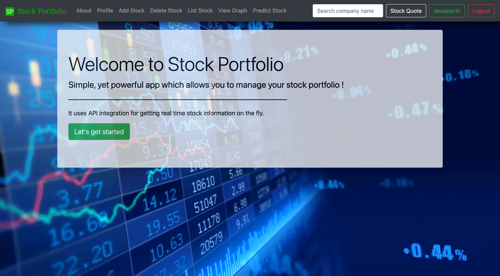
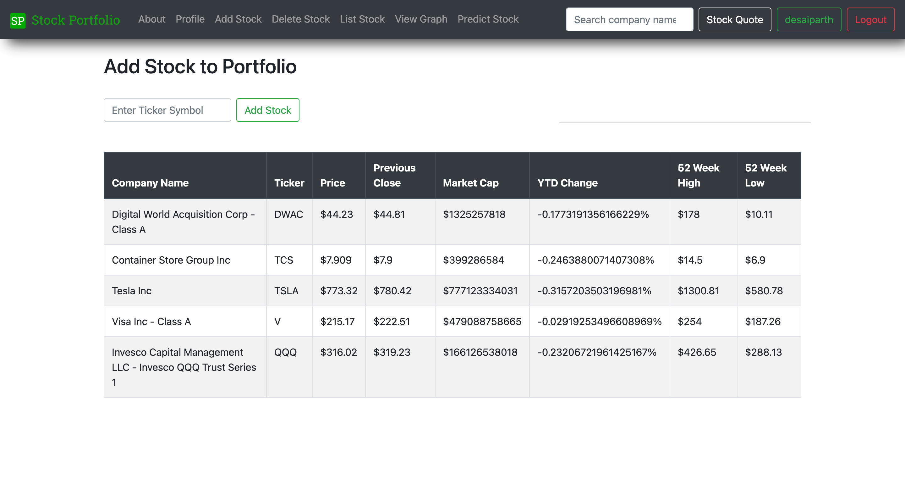
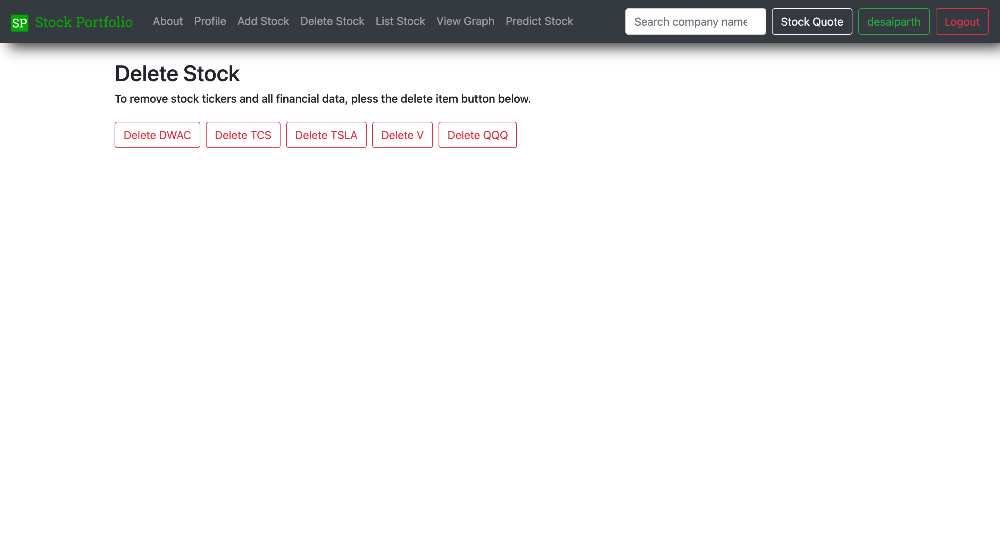
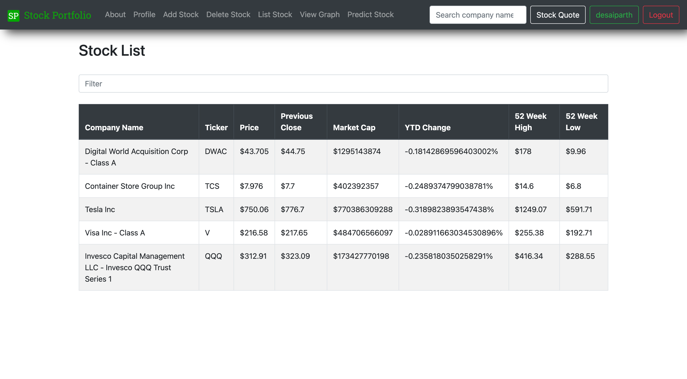
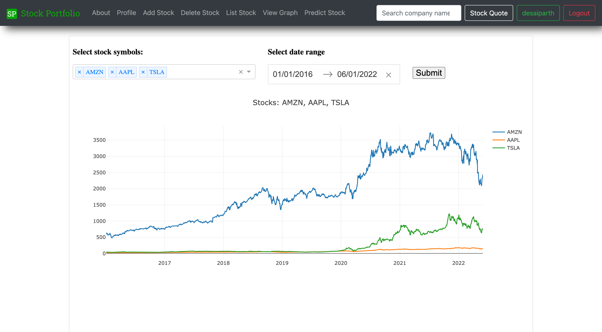
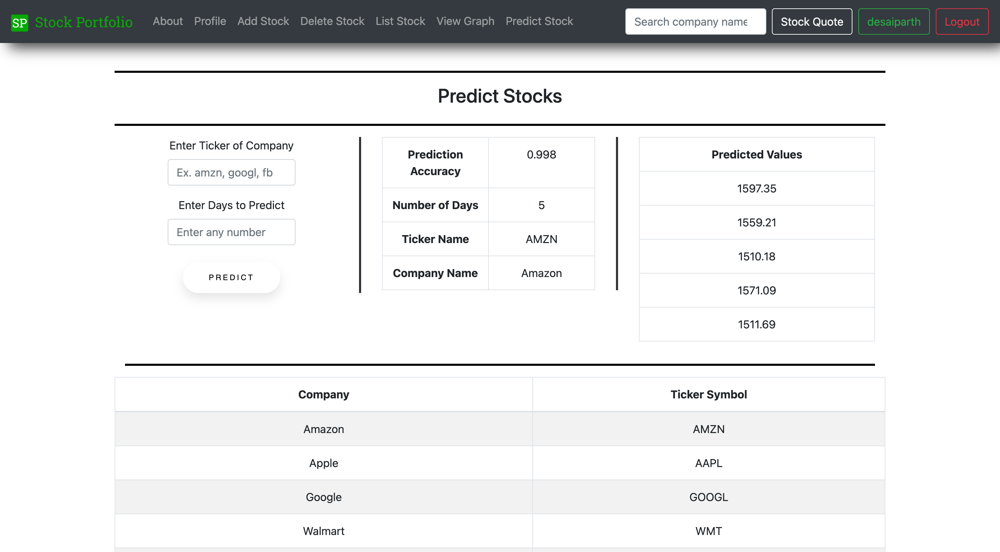
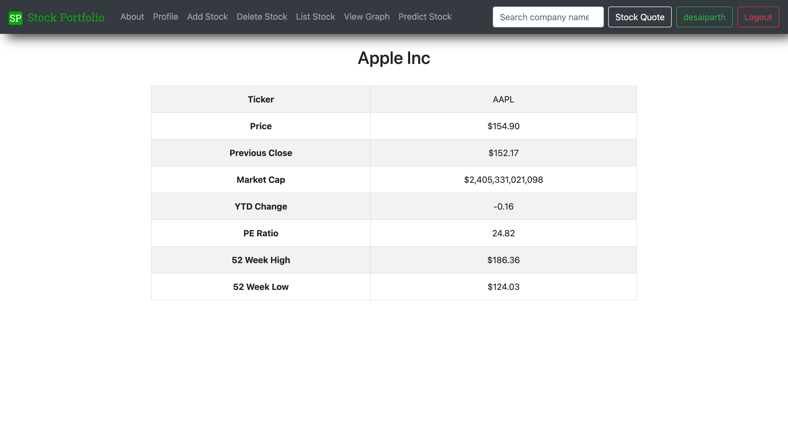
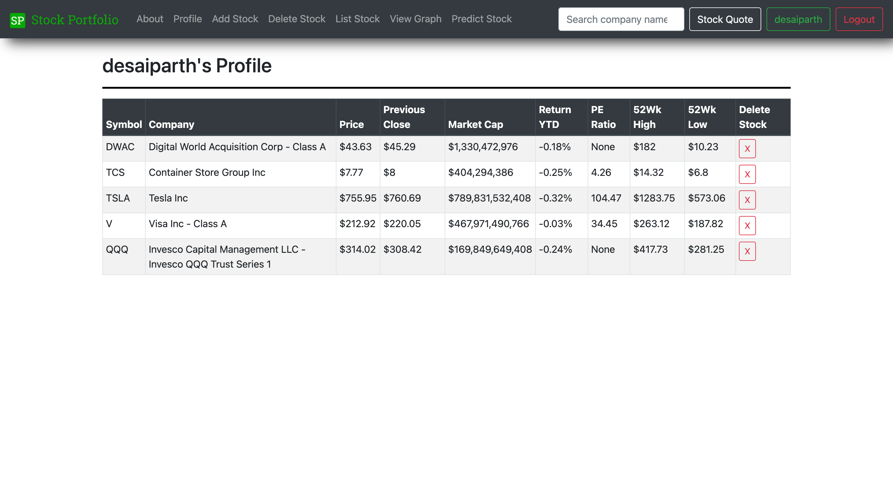

<div align="center">
  
</div>

<h1 align="center">
  Stock Management App
</h1>

<div align="center">

  

</div>

<p align="justified">
  It is a web application for <b>managing your investment portfolio</b>. Users can get real-time stock data and market news via <em>Yahoo Finance, IEX Cloud, and Quandl APIs</em>. They can also compare the performance of the stocks with charts and predict the future behaviour for the same. Users are given the ability to create a customizable stock portfolio and watchlist to track both current and prospective holdings.
</p>

<p align="justified">
  You can easily search tickers through the integrated API platform provided by <i>iexcloud.io</i> as well as easily add, edit or delete tickers based on your preferences.
</p>



## ⚙️ Tech Stack

       

## 🛠 Installation & Set Up

1. Clone the project repository
```bash
git clone https://github.com/pycoder2000/Stock-Management-App.git
```

2. Move to the project root folder.
```bash
cd djangochat
```

3. Create and activate a virtual environment.
> (for mac)
```bash
virtualenv env
source env/bin/activate
```

To deactivate the environment
```bash
deactivate
```

4. Install requirements

```bash
pip3 install -r requirements.txt
```

5. Initialize database
```bash
python3 manage.py migrate
```

6. Create admin user
```bash
python3 manage.py createsuperuser
```

7. Run development server
```bash
python3 manage.py runserver
```

## 👷 Original Contributors

  |<a href="https://github.com/pycoder2000" target="_blank">Parth Desai</a>|<a href="https://github.com/parth-panchal" target="_blank">Parth Panchal</a>|<a href="https://github.com/Nirav-Madhani" target="_blank">Nirav Madhani</a>|
  |---|---|---|

## 🚨 Forking this repo

If you fork this website, **please attribute it** to the original author.

## 🚀 Features and Pages
<hr>

<h3 align="center">Add Stock</h3>
  
<p align="justified">
<b>Description</b> : The add stock page enables the user to add a stock ticker of his/her choice to their account portfolio. It utilizes a database function to store the ticker symbols when requested as a way of developing a personal portfolio. It is a page designed to show the tickers in the user’s portfolio and allows them to delete them individually as the investment strategy changes over time.
</p>

<hr>



<hr>

<h3 align="center">Delete Stock</h3>
  
<p align="justified">
<b>Description</b> : The delete stock function is used to remove any stock from the user’s portfolio in case he/she is no longer interested in trading that particular stock. It also includes the functionality which helps return the rendered webpage which enables the user to delete the stock.
</p>

<hr>



<hr>

<h3 align="center">List Stock</h3>
  
<p align="justified">
<b>Description</b> : The list section shows the different stocks that the user has added to his portfolio. It gives a tabular representation of all the important details related to each stock, like the symbol, company name, its price, previous close, market cap, return YTD, PE Ratio, 52Wk High, and 52 week low. In addition to this, it also allows the user to search for stocks he/she has added, and filter the view accordingly.
</p>

<hr>



<hr>

<h3 align="center">View Graph</h3>
  
<p align="justified">
<b>Description</b> : The viewgraph functionality is a very useful tool for the user. It enables the user to view and analyze trends for any stock right here in the app, without the need to go to another site for the same. It is a very extensive tool and we have enabled this with the help of a plotly graph called stock-graphic, which is a stock visualization graph. It allows the user to view trends of multiple stocks at the same time, within any given date range.
</p>

<hr>



<hr>

<h3 align="center">Predict Stock</h3>
  
<p align="justified">
<b>Description</b> : The predict stock page is a tool that serves as a means for the user to predict the future prices of the required stocks. It uses a simple linear regression algorithm that makes predictions based on the previous prices of the said stock. The tool takes the ticker of the stock and the number of days to predict for as the input, and then gives out the predicted values and the accuracy of those values, as the output.
</p>

<hr>



<hr>

<h3 align="center">Search Stock</h3>
  
<p align="justified">
<b>Description</b> : The search stock page gives the user the ability to search for any stock.
</p>

<hr>



<hr>

<h3 align="center">Profile Page</h3>
  
<p align="justified">
<b>Description</b> : The profile section shows the different stocks that the user has added to his portfolio. It gives a tabular representation of all the important details related to each stock, like the symbol, company name, its price, previous close, market cap, return YTD, PE Ratio, 52Wk High, and 52 week low. It also gives the user the easy option of a quick-delete button, where he/she can remove a stock from the profile page itself, if required.
</p>

<hr>



<hr>

## 📘 Django concepts utilized

- Created different Django views
- URL Mapping
- Implemented different templates
- Utilized built-in and custom tags and filters
- Using templates in views
- Template Inheritance
- Assets handing
- Crispy Forms
- Form rendering process
- Used build-in and custom widgets
- Installation and Configuration of Database
- Defining personal model
- Database CRUD operations
- Rendering model in Admin interface
- Fields validation
- Customizing Authentication
- Admin Interface and its control
- User and group creation
- Permission Handling
- Utilized Django Rest Framework
- Created graphs in Django with the help of Plotly Dash

## 🎖️ Challenges

1. Researching about different investment strategies and gaining the required financial knowledge to carry out the project.
2. Exploring the free APIs that can provide historical and real time stock data.
3. Preparing the chart data to give to Django Plotly Dash.